# Web Scrapping Using BeautifulSoup

## Web Scrapping

Web scraping, web harvesting, or web data extraction is data scraping used for extracting data from websites.[1] Web scraping software may access the World Wide Web directly using the Hypertext Transfer Protocol, or through a web browser. While web scraping can be done manually by a software user, the term typically refers to automated processes implemented using a bot or web crawler. It is a form of copying, in which specific data is gathered and copied from the web, typically into a central local database or spreadsheet, for later retrieval or analysis.
[Source](https://en.wikipedia.org/wiki/Web_scraping "Title")

## Scarpping with BeautifulSoup for beginners

BeautifulSoup is very powerful library for HTML Dom parsing. In this tutorial, we are extracting search listing from [Yelp](https://www.yelp.com/search?find_desc=Asian%20Food&find_loc=fortworth%2C%20TX "Title"). Since Yelp is updating its website DOM regularly so have downloaded 1 page of search list and parse it.

## Pre-requisite
* Python
* Pip

You can install using any tutorial on your pc. If you are using mac you don’t have to install python its is already installed just check the version but if you are using windows follow [tutorial](https://matthewhorne.me/how-to-install-python-and-pip-on-windows-10/ "Title") he has provided everything you need for setup and also show how you can test whether it is installed or not.

## Libraries
* beautifulsoup4
* XlsxWriter
* regex
* lxml

## Installation

1. Clone this repo or download it as a zip file
2. Open command prompt and goto directory where code is located using command
>	cd “path of folder”
3. run following pip command to install all required libraries
> 	pip install –r requirements.txt
4. Now everything is setup, double click on scrape.py it will show you that html file is parsed and excel file is created.

## Explanation
Time to learn parsing so you can update dom element when Yelp make changes on their site.

### [Search Page](screenshots/listing)
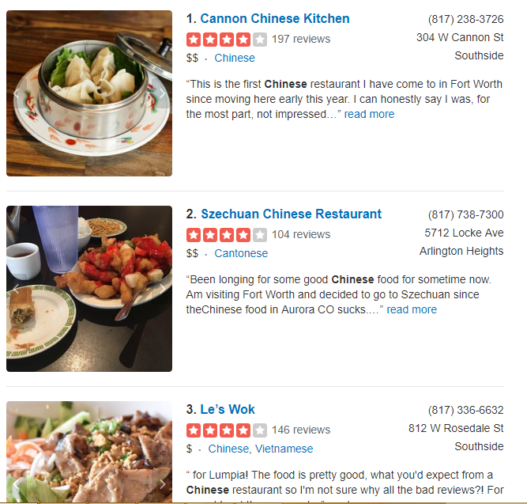

From this search results we want to extract restaurant name, reviews, phone number, address, category as highlighted below
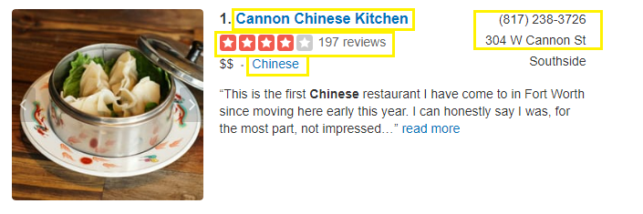

## Get Started
In scrape.py file you will find a function parse_html which is used for scrapping. 
First we open html file using **open** function
Python 2
> html = open("yelp_listing.html", 'r')

Python 3
> open("yelp_listing.html", 'r', encoding="utf8")

Next is initializing BeautifulSoup object with text read from html file.
> soup = BeautifulSoup(html,"lxml")

Once the soup object is created you have to find the DOM element of listing which is done by 
	* right click on page
	* inspect element
	
You will see following thing
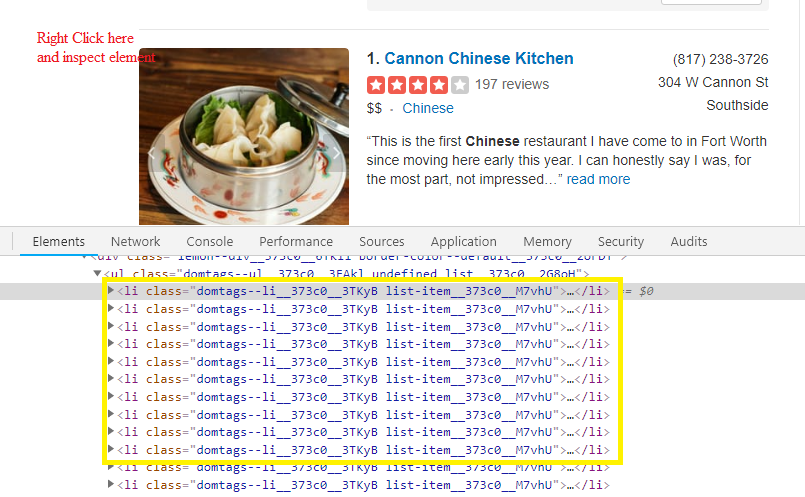

there are <li> tag with class 'domtags--li__373c0__3TKyB list-item__373c0__M7vhU' so we are getting all the list tags using **find_all**
 
> listings = soup.find_all('li' , {'class' : 'domtags--li__373c0__3TKyB list-item__373c0__M7vhU'})

Next is we are using for loop to iterate on each li element
> for li in listings:

In this li, first we will find the div which contains name of restaurant. 
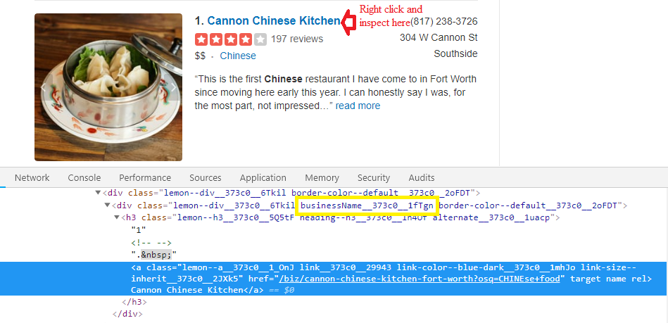

> li_div = li.find('div', {'class':'businessName__373c0__1fTgn'})

We have some Ad with search results that we want to ignore and don't want in out data so for that we are using if condition and checking whether there is a 
 tag within name div if yes then ignore that <li> tag.

> if li_div and not li_div.find('p'):

We know that **name** is in <a> tag so we are finding that
>	row["name"] = ""
	
>	if li_div.find('a'):

>       row["name"] = li_div.find('a').text

There are 2 different tags used for **address**
1:
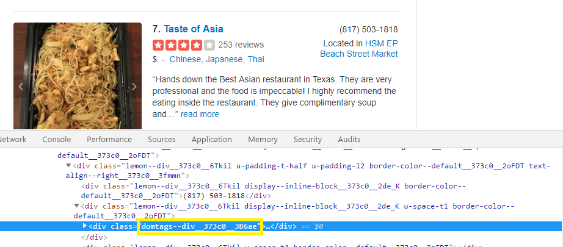

2:
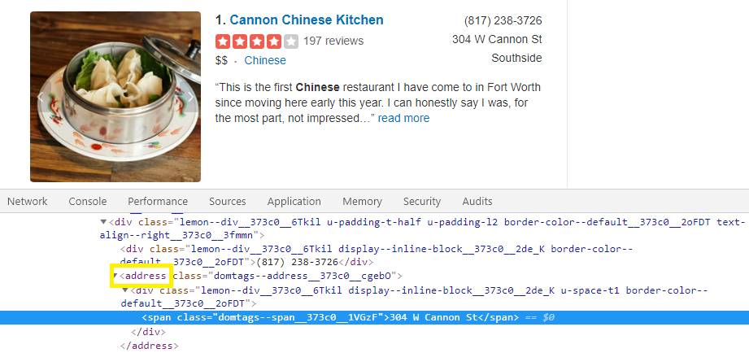

so we are using
>	row["address"] = ""

>	address = li.find('div', {'class':'domtags--div__373c0__3B6ae'})

>	if address:

>	    row["address"] = address.text.replace("\n", " ").strip()

>	elif li.find('address'):

>		row["address"] = li.find("address").text.replace("\n", " ").strip()

**Phone** number is extracted using
>	row["phone"] = ""

>	phone = li.find('div', {'class':'lemon--div__373c0__6Tkil display--inline-block__373c0__2de_K border-color--default__373c0__2oFDT'})

>	if phone:

>	    row["phone"] = phone.text.replace("\n", " ").strip()

You can see the div with that class in below image
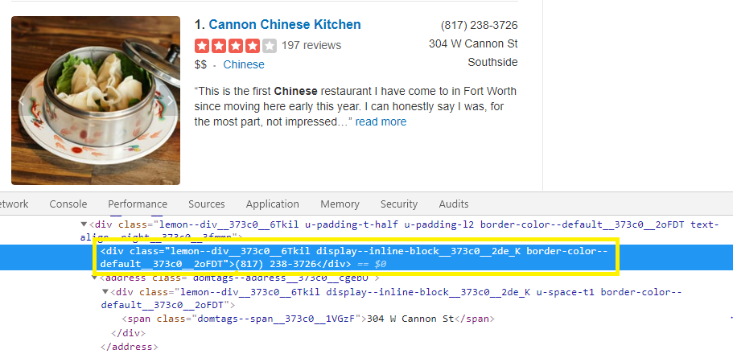

To find the **category** we have div
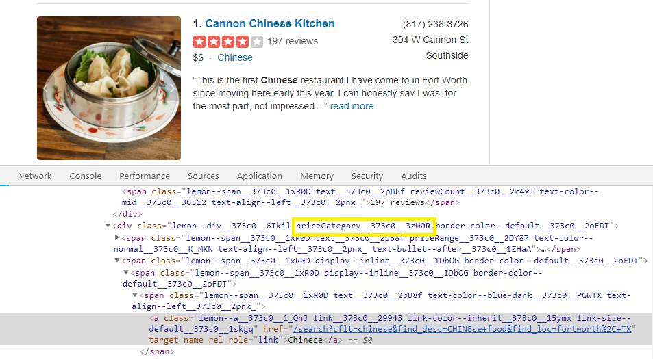

>		row["type"] = ""

>		category = li.find('div', {'class':'priceCategory__373c0__3zW0R'})

>		if category:

>		    row["type"] = category.text.replace("\n", " ").replace("$", "").strip()

Getting **reviews** is same by inspecting on element
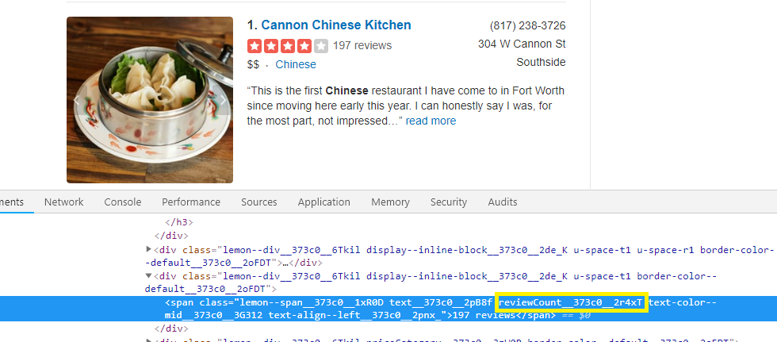

>	row["review"] = ""

>	review = li.find('span' , {'class' : 'reviewCount__373c0__2r4xT'})

>	if review:

>	    row["review"] = review.text.replace("\n", "").strip()

 Getting **stars** is same by inspecting on element
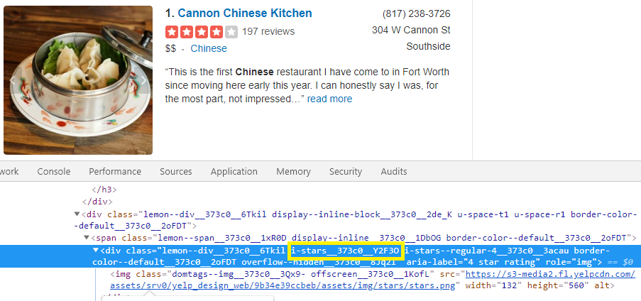

>	row["stars"] = ""

>	stars = li.find('div' , {'class' : 'i-stars__373c0__Y2F3O'})

>	if stars:

>	    row["stars"] = stars['aria-label'].replace("\n", "").strip()

## Result
Once everything is extracted final excel file will looks like
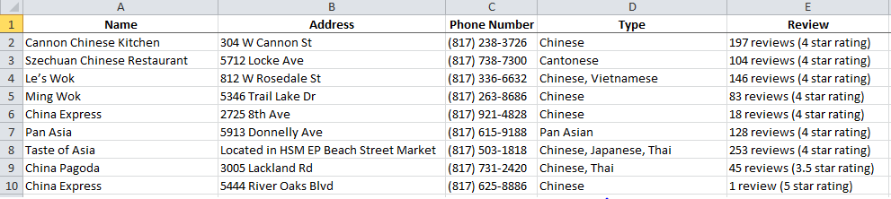
